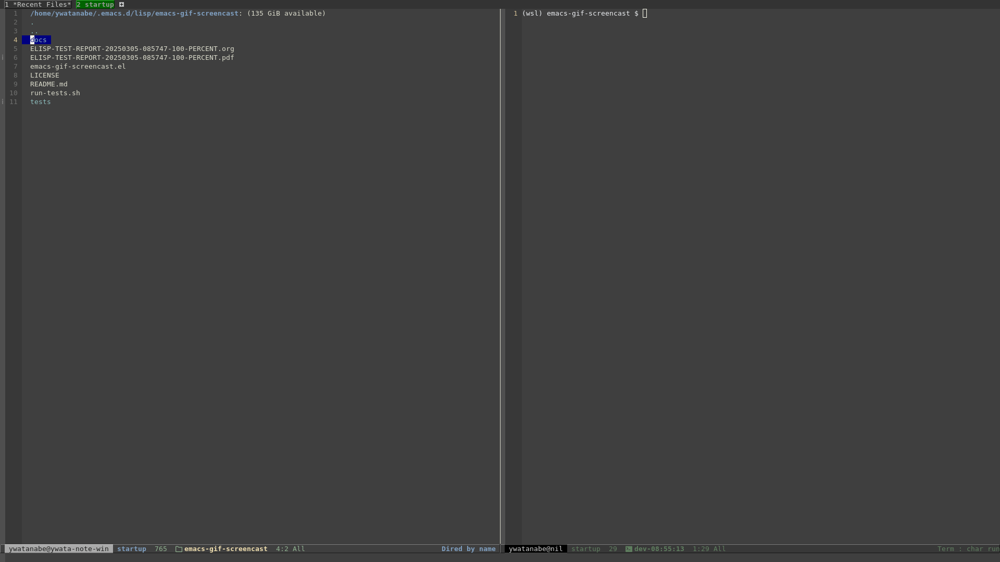

<!-- ---
!-- Timestamp: 2025-03-05 08:59:58
!-- Author: ywatanabe
!-- File: /home/ywatanabe/.emacs.d/lisp/emacs-gif-screencast/README.md
!-- --- -->

# Emacs GIF Screencast

[](https://github.com/ywatanabe1989/emacs-gif-screencast/actions)

A package to create GIF screencasts from within Emacs with minimal setup.



## Features

- Records every user action as a frame
- Supports multiple platforms (Linux, macOS, WSL)
- Built-in native capture option (no external dependencies)

## Installation

### Manual installation

Clone the repository:
```bash
git clone https://github.com/username/emacs-gif-screencast.git ~/.emacs.d/lisp/emacs-gif-screencast
```

Add to your init.el:
```elisp
(add-to-list 'load-path "~/.emacs.d/lisp/emacs-gif-screencast")
(require 'emacs-gif-screencast)
```

### with use-package

```elisp
(use-package emacs-gif-screencast
  :ensure nil  ;; if using straight or another package manager
  :load-path "~/.emacs.d/lisp/emacs-gif-screencast"
  :bind
  ("<f8>" . emacs-gif-screencast))
```

## Usage

1. Call `M-x emacs-gif-screencast` to start recording
2. Perform the actions you want to record
3. Press <f9> (default) to stop recording and generate the GIF
4. Press <f8> while recording to pause/resume

The GIF will be saved to the directory specified by `emacs-gif-screencast-output-directory` or the current `default-directory` if that variable is nil.

## Configuration

### Basic options

```elisp
;; Set output directory (nil means use default-directory)
(setq emacs-gif-screencast-output-directory "~/Pictures/emacs-gifs")

;; Set output resolution (width:height, -1 means preserve aspect ratio)
(setq emacs-gif-screencast-resolution "1920:-1")

;; Enable native capture (no external dependencies)
(setq emacs-gif-screencast-use-native-capture t)
```

### Advanced options

```elisp
;; Use FFmpeg instead of ImageMagick for better quality
(setq emacs-gif-screencast-enable-ffmpeg t)

;; Configure countdown before recording starts
(setq emacs-gif-screencast-countdown 3)

;; Keep temporary screenshots (for debugging)
(setq emacs-gif-screencast-autoremove-screenshots nil)
```

## Requirements

By default, the package tries to use external programs:
- Linux: `scrot` for screenshots, `convert`/`mogrify` (ImageMagick) for processing
- macOS: `screencapture` for screenshots
- Optional: `gifsicle` for optimization, `ffmpeg` for better quality

When `emacs-gif-screencast-use-native-capture` is enabled, no external dependencies are needed.

## Acknowledgments

This repository is developed based on https://github.com/Ambrevar/emacs-gif-screencast.

## License

Copyright (C) 2025 Yusuke Watanabe <ywatanabe@alumni.u-tokyo.ac>

<!-- EOF -->